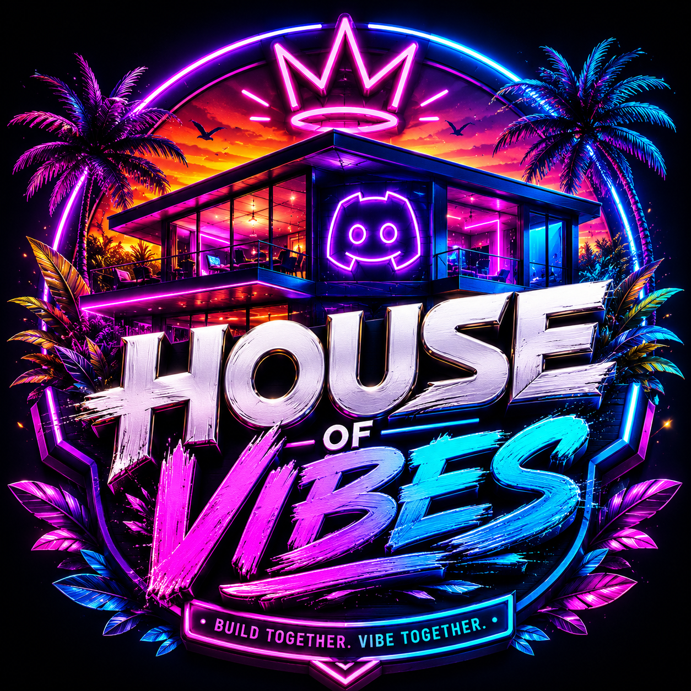
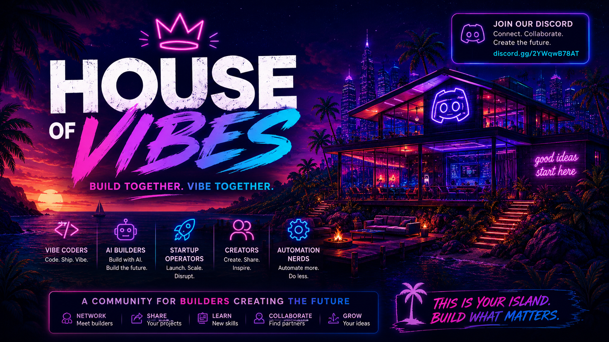
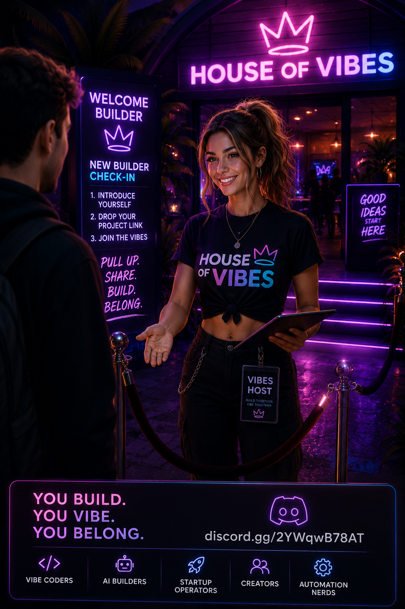
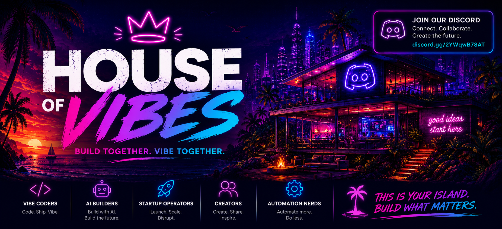
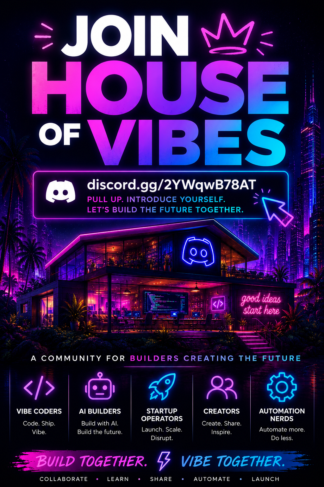

  

<h1 align="center">
  House of Vibes 
  A Field Guide to Vibe Coding, AI IDEs & Agent Tooling
</h1>

A curated, living list of real communities, tools, and learning resources for anyone building software with AI, whether you've never written a line of code, you're a hobbyist "explorer," or you're a professional engineer adopting agentic tools.

> **Last verified:** July 2026. Tool pricing, Discord member counts, and blog-sourced comparisons change fast. Treat anything without an official source link as a starting point for your own research, not gospel. See [Contributing](#contributing--keeping-this-list-active) if you spot something stale or missing.

## Table of Contents

- [🏠 Featured Community: House of Vibes](#featured-community-house-of-vibes)
- [✨ What Is "Vibe Coding"?](#what-is-vibe-coding)
- [💬 Communities: Discord, Slack, Reddit & Forums](#communities-discord-slack-reddit--forums)
- [📅 Live Events, Meetups & Conferences](#live-events-meetups--conferences)
  - [🎪 Conferences](#conferences)
- [🌱 Learn to Vibe Code: Getting Started](#learn-to-vibe-code-getting-started)
- [🛠️ IDEs & Tools](#ides--tools)
  - [🖥️ Primary AI IDEs (Desktop)](#primary-ai-ides-desktop)
  - [☁️ Cloud / Browser IDEs & No-Code App Builders](#cloud--browser-ides--no-code-app-builders)
  - [🧰 Editor Extensions & Secondary Tools](#editor-extensions--secondary-tools)
  - [⌨️ CLI & Terminal Coding Agents](#cli--terminal-coding-agents)
  - [🔀 Model Access, Routing & Local Models](#model-access-routing--local-models)
  - [🤖 Personal AI Agent Platforms](#personal-ai-agent-platforms)
- [🎬 AI Video & Voice Generation](#ai-video--voice-generation)
  - [🎥 AI Video](#ai-video)
  - [🎙️ AI Voice](#ai-voice)
- [🔌 Connectors, MCP & OAuth for Your Agent](#connectors-mcp--oauth-for-your-agent)
- [🔒 Security Topics](#security-topics)
- [🧩 Agent Skills: Getting Started](#agent-skills-getting-started)
  - [📄 Project Context Files (CLAUDE.md, AGENTS.md, GEMINI.md, and Friends)](#project-context-files-claudemd-agentsmd-geminimd-and-friends)
  - [🎯 VS Code's Scoped Instructions Files](#vs-codes-scoped-instructions-files)
  - [⭐ Popular community skills to try](#popular-community-skills-to-try)
  - [🛒 Where to find more skills (marketplaces & directories)](#where-to-find-more-skills-marketplaces--directories)
- [📚 Books & Further Reading](#books--further-reading)
- [🤝 Contributing / Keeping This List Active](#contributing--keeping-this-list-active)

---

## 🏠 Featured Community: House of Vibes

  

**[Join House of Vibes on Discord →](https://discord.gg/2YWqwB78AT)** (or visit [houseofvibes.app](https://houseofvibes.app/)): a free builder community for people using AI, automation, content, code, and internet-native tools to create what comes next. Built for vibe coders, AI builders, founders, creators, startup operators, and automation nerds who'd rather build alongside other people than alone. Runs a daily builder hangout, weekly demo days, a project showcase channel, and a gamified XP leaderboard. New and growing, and a good time to be an early regular rather than one of thousands.

---

## ✨ What Is "Vibe Coding"?

Replit's own docs give the clearest definition of the term: you start from a **plain-language description of what you want**, not code, and work in a loop of *describe → preview → give feedback → publish*. Critically, Replit is explicit that **you don't have to be a developer to do this**: your job is closer to a product lead who directs goals, audience, and taste, while the AI agent handles the actual code generation, debugging, and iteration.

- 📖 [Vibe Coding 101 (Replit Docs)](https://docs.replit.com/learn/foundations/vibe-coding-101) *(official, free)*

That framing matters for this guide: it's written so a complete beginner, a non-technical "explorer," and a professional engineer can all find their on-ramp.

---

## 💬 Communities: Discord, Slack, Reddit & Forums

### Discord servers

Member counts are live snapshots pulled from Discord's public invite API on July 17, 2026, and will drift over time.

**AI labs & model providers**

| Community | Link | Members | Why join |
|---|---|---|---|
| OpenAI | [discord.gg/openai](https://discord.gg/openai) | ~852,000 | Official server: ChatGPT, Codex, and OpenAI's latest models. Requires verifying an OpenAI account to fully join. |
| Claude | [discord.gg/6PPFFzqPDZ](https://discord.gg/6PPFFzqPDZ) | ~115,000 | Large, active Claude/Anthropic-focused community. **Note:** the commonly-cited `discord.gg/anthropic` invite is dead/expired as of this writing; this is the verified working link. |
| Nous Research | [discord.gg/nousresearch](https://discord.gg/nousresearch) | ~127,000 | Open-source AI community behind the Hermes model family |
| Hugging Face | [discord.gg/hugging-face-879548962464493619](https://discord.gg/hugging-face-879548962464493619) | ~227,000 | The ML/model-hub community, verify to link your HF Hub account |
| Midjourney | [discord.gg/midjourney](https://discord.gg/midjourney) | ~18,800,000 | Official server for the text-to-image AI |

**Vibe coding & AI dev tools**

| Community | Link | Members | Why join |
|---|---|---|---|
| Cursor | [discord.gg/cursor](https://discord.gg/cursor) | ~38,000 | Official Cursor server: people building with AI, real-time help |
| Cline | [discord.gg/cline](https://discord.gg/cline) | ~23,000 | Community for the open-source Cline VS Code agent |
| Lovable | [discord.gg/lovable-dev](https://discord.gg/lovable-dev) | ~172,000 | Vibe-coding / AI app-building community around the Lovable platform |
| OpenClaw (Clawdbot), aka *"Friends of the Crustacean"* | [discord.gg/clawd](https://discord.gg/clawd) | ~176,000 | Personal-AI-agent project, now a 501(c)(3) nonprofit foundation |

**Builder, founder & startup communities**

| Community | Link | Members | Why join |
|---|---|---|---|
| Furlough | [discord.gg/furlough](https://discord.gg/furlough) | ~55,000 | Entrepreneurs collaborating on marketing, e-commerce, startups, AI |
| Tech Startups | [discord.gg/startups](https://discord.gg/startups) | ~19,700 | Business-focused technologists building in public together |

**Learn to code**

| Community | Link | Members | Why join |
|---|---|---|---|
| freeCodeCamp | [discord.gg/freecodecamp-692816967895220344](https://discord.gg/freecodecamp-692816967895220344) | ~41,500 | Official freeCodeCamp.org server: learn to code, get help |

### 👽 Reddit

- [r/vibecoding](https://www.reddit.com/r/vibecoding/): general vibe coding discussion, project showcases
- [r/ChatGPTCoding](https://www.reddit.com/r/ChatGPTCoding/): AI-assisted coding across tools, not just ChatGPT
- [r/cursor](https://www.reddit.com/r/cursor/): Cursor-specific
- [r/LocalLLaMA](https://www.reddit.com/r/LocalLLaMA/): local/offline LLM setups (relevant if you want to run models yourself)

### 🌐 Web forums & communities

- [Vibe Coding Forem](https://vibe.forem.com/): dedicated discussion forum
- [Vibehackers](https://vibehackers.io/): gallery/job board + community for vibe-coded projects
- [Vibe Coding Community (GitHub)](https://github.com/Vibe-Coding-Community): GitHub-based community org
- [Indie Hackers](https://www.indiehackers.com/): broader solo/small-team founder community, heavy AI-building overlap
- [Product Hunt (AI topic)](https://www.producthunt.com/topics/artificial-intelligence): where a lot of vibe-coded products launch and get feedback
- [Hacker News](https://news.ycombinator.com/): not vibe-coding-specific, but where the ecosystem's biggest debates happen

### 📌 A note on Slack

Despite a deliberate search, we could **not confirm a dedicated, active Slack workspace specifically for vibe coding**: the two most actively-maintained community lists in this space ([taskade/awesome-vibe-coding](https://github.com/taskade/awesome-vibe-coding), [filipecalegario/awesome-vibe-coding](https://github.com/filipecalegario/awesome-vibe-coding)) both list multiple Discord servers but zero Slack workspaces. If your workflow leans Slack rather than Discord:

- [Slack's own developer/agent-builder community](https://slack.dev/) covers building *on* Slack (Agent Builder, MCP integration) rather than vibe coding generally, but is a real, active dev community if you're building Slack-native agents.
- Adjacent no-code communities (several run their own Slack groups): [No Code Founders](https://nocodefounders.com/), [WeAreNoCode](https://www.wearenocode.com/), [Zerocoder](https://zerocoder.com/no-code-community/), [NoCodeOps](https://www.nocodeops.com/community).

If you know of an active, vibe-coding-specific Slack workspace, please open an issue or PR. This is a known gap, not an oversight.

---

## 📅 Live Events, Meetups & Conferences

SF Bay Area–based Meetup groups worth joining, verified directly against their group pages. Most run primarily **virtual/online** sessions (so they're joinable from anywhere); one (Hacker Dojo, at the bottom) is an in-person-only physical space.

- **[Microsoft Reactor San Francisco](https://www.meetup.com/microsoft-reactor-san-francisco/)**: ~7,400 members, 4.3★ (1,420 ratings). Microsoft's own free technical-learning program ("centers for free technical learning and sharing"), run by Microsoft as Super Organizer alongside 13 co-organizers. Covers AI, cloud computing, open source, and startups. By far the most active group here: **virtual events run continuously** ("anytime, anywhere"), with dozens of events scheduled at any given time and 2,600+ run historically. Recurring series include the monthly **"SF AI Show + Tell"** (demos + talks, hosted at GitHub HQ SF) and the periodic **"AI Innovation Summit SF"** (keynotes, panels, workshops). Contact `ReactorSF@Microsoft.com` for space/collab inquiries.
- **[AI Builders and Learners SF](https://www.meetup.com/ai-builders-and-learners-sf/)**: ~2,900 members, 4.7★ (149 reviews). "A passionate community dedicated to building and learning about artificial intelligence," covering ML, LLMs, deep learning, MLOps, Python, computer vision, and NLP. Runs a **weekly virtual "AI Build & Learn" stream** (Fridays, 12:00 PM PDT) on rotating topics, plus a **monthly AI book club**. Organized by Sage Elliott; hosts both SF-local and fully virtual sessions.
- **[Silicon Valley Generative AI ~ The AI Collective Network](https://www.meetup.com/silicon-valley-generative-ai/)**: ~4,600 members, 4.5★ (350 reviews). A generative-AI-focused community for professionals, researchers, and founders, part of The AI Collective network. Runs **bi-weekly virtual paper-reading sessions** (in partnership with Boulder Data Science) plus **monthly talks** from researchers, founders, and practitioners covering technical topics, applications, and startup pitches. Organized by Matt White.
- **[Bay Area Content Marketing](https://www.meetup.com/bay-area-content-marketing/)**: ~4,200 members, 4.8★ (1,026 reviews), running since 2015. A general marketing (not AI-specific) community that has leaned increasingly into AI-assisted content workflows in its programming. Mixes **virtual talks** with occasional **in-person Bay Area networking events**. Organized by Dennis Shiao. Worth it if your vibe-coding projects lean toward content, marketing, or growth tooling rather than pure engineering.
- **[Silicon Valley Startup: Idea to IPO](https://www.meetup.com/silicon-valley-startup-idea-to-ipo/)**: ~30,900 members, 4.5★ (3,730 ratings). Palo Alto–based, part of a global "Idea to IPO" network of 160 meetup groups, for entrepreneurs, VCs, angel investors, and startup professionals. Runs **both online and in-person events**, including VC panels (e.g. "What's Hot, What's Not"), fundraising/crowdfunding workshops, networking mixers, and watch parties, with 80+ events typically scheduled at once, making it one of the most active groups on this list. Organized by Rohit "Ray" A. Not AI-specific, but a strong pick if you're vibe-coding toward an actual startup and want funding/go-to-market guidance alongside the build side.
- **[BayNode: The Bay Area Node.js Meetup](https://www.meetup.com/baynode/)**: ~1,950 members, 4.6★ (240 reviews), Mountain View. "A community focused node.js meetup" running **"Node Night"** talk events (2–3 talks per session, food & drinks, member speakers prioritized) plus an unstructured social called **"Beer.node."** Traditionally in-person, though recent sessions have run online via Zoom. Organized by Jimmy Guerrero. Not AI-specific, but the JS/Node ecosystem underpins most of the vibe-coding tools in this guide, useful if you want to go deeper on the actual engineering under the hood.
- **[Hacker Dojo](https://www.meetup.com/hackerdojo/)**: ~19,400 members, 4.7★ (3,107 reviews). **In-person only**: a 501(c)(3) nonprofit hackerspace/community center at 855 Maude Ave, Mountain View, CA, open 24/7. "A location for Startups, Events, Lectures, Hackathons, DevHouses, tinkering, brainstorming, co-working, and more." Extremely active: over a hundred events scheduled at any given time (2,500+ run historically), plus recurring staples like a weekly Happy Hour and Friday Night Socials. Good pick if you're actually in the Bay Area and want in-person building company rather than a virtual talk.

Note: Microsoft Reactor SF, Silicon Valley Startup: Idea to IPO, and Hacker Dojo all had dozens of events on their public calendars at the time of writing; AI Builders and Learners SF, Silicon Valley Generative AI, and Bay Area Content Marketing did not have near-term events listed at the moment we checked. Meetup groups post new events on a rolling basis rather than far in advance, so check each group's page directly for the next scheduled date.

### 🎪 Conferences

Major AI industry conferences:

| Conference | Dates & Location | Notes |
|---|---|---|
| World Summit AI | Oct 7–8, 2026, Amsterdam (Taets Art & Event Park) | 10th edition: 300+ speakers, 10 tracks, 10,000+ attendees, 100+ exhibitors. [worldsummit.ai](https://worldsummit.ai/) |
| ODSC AI West | Oct 27–29, 2026, Hyatt Regency San Francisco Airport, Burlingame, CA | Technical, hands-on conference for data scientists, ML engineers, and applied AI teams. [odsc.ai/west](https://odsc.ai/west/) |
| AI Infra Summit | Sep 15–17, 2026, Santa Clara Convention Center, CA | ~8,000 attendees, 400+ speakers, fully in-person. Five tracks: compute, data movement, physical AI, data & models, AI data centers. [ai-infra-summit.com](https://www.ai-infra-summit.com/) |
| NeurIPS 2026 | Dec 6–12, 2026, Sydney, Australia (ICC Sydney) | The flagship academic ML/AI research conference, with official satellite events in Atlanta and Paris running the same week. [neurips.cc](https://neurips.cc/) |
| The AI Summit (series) | Multiple cities in 2026: London (Jun 10–11), Las Vegas (Aug 4), Melbourne (Sep 7–9), New York (Dec 9–10) | A global series rather than a single event; pick whichever city is closest to you. [About the series](https://london.theaisummit.com/about/ai-summit-event-series/) |
| The AI Conference | Sep 29–Oct 1, 2026, Pier 48, San Francisco | 5,500+ builders, researchers, and leaders; 120+ speakers; 5 tracks (AGI, LLMs, agentic AI, infrastructure, applied AI). Optional capped "Day Zero" workshop day plus a live hack day. [aiconference.com](https://aiconference.com/) |

Vibe coding–specific conferences (smaller and newer than the industry events above, worth watching given how fast this space moves):

| Conference | Dates & Location | Notes |
|---|---|---|
| Vibecon | Jun 17–18, 2026, New York (Canyon, Lower East Side) | Replit's inaugural "code meets culture" event: artists, filmmakers, designers, and technologists exploring code as a creative medium rather than a straight developer conference. |
| Vibe Coder Conference | Jun 25–27, 2026, virtual | Fully online, so no travel required. [vibecoderconference.com](https://vibecoderconference.com/) |
| Create With Conference | Jun 25, 2026, Brighton Centre, Brighton, UK | The UK's flagship AI/no-code builder event: 600+ attendees, 20+ talks, hands-on workshops where you leave with something you actually built, plus a live-build "Tech for Good" charity track. [createwith.com/conference](https://www.createwith.com/conference) |

**Note:** Vibe Coder Conference, Vibecon, and Create With Conference are three distinct events with similar names and overlapping June 2026 dates. Double-check which one you're registering for.

---

  
   
  🏠 New to all this? <a href="https://discord.gg/2YWqwB78AT">House of Vibes</a> is a free Discord for people building with AI who'd rather not do it alone: drop your project, get feedback, find collaborators.

---

## 🌱 Learn to Vibe Code: Getting Started

- 📖 [Vibe Coding 101 (Replit Docs)](https://docs.replit.com/learn/foundations/vibe-coding-101) *(official, free, best starting point)*: the describe → preview → feedback → publish loop, written for non-developers.
- 🎓 [Vibe Coding 101 with Replit (DeepLearning.AI)](https://www.deeplearning.ai/short-courses/vibe-coding-101-with-replit/) *(free short course)*: hands-on, built with Replit. Note: we could not independently confirm marketing claims that it's tailored for people with *zero* prior coding vocabulary, so if you are a true beginner, expect some ramp-up rather than a hand-held zero-to-hero path.
- 📖 [DataCamp: Vibe Coding Guide for Beginners](https://www.datacamp.com/blog/vibe-coding-guide-for-beginners): useful for the underlying taxonomy of tool types (see below), less so as a step-by-step tutorial.

**Honest gap:** we specifically looked for a course genuinely designed for complete non-technical beginners and couldn't verify one exists as advertised. Best current path for a true beginner: start with Replit's free docs above, pick one small real project (not a tutorial), and use the Discord/Reddit communities above when you get stuck.

---

## 🛠️ IDEs & Tools

A rough taxonomy (per [DataCamp](https://www.datacamp.com/blog/vibe-coding-guide-for-beginners)) that's useful for orienting yourself: **agent-based tools** that generate/modify whole projects (Claude Code, Replit Agent), **IDE-integrated assistants** bolted onto an existing editor (GitHub Copilot), **chat-based tools** (ChatGPT, Claude.ai), and **local/offline LLM setups** (Ollama, LM Studio). The lists below are a curated starting set, not exhaustive. For the long tail (200+ tools), see the two awesome-lists linked at the bottom of this section.

### 🖥️ Primary AI IDEs (Desktop)

| IDE | Link | Notes |
|---|---|---|
| Cursor | [cursor.com](https://cursor.com) | VS Code fork, currently the most widely benchmarked AI-first editor |
| Windsurf | [windsurf.com](https://windsurf.com/) | VS Code fork; per [Zapier's comparison](https://zapier.com/blog/windsurf-vs-cursor/), its agent tends to make more decisions autonomously rather than requiring approval at every step, often recommended for non-technical "vibe coders" for that reason |
| Zed | [zed.dev](https://zed.dev/) | High-performance, Rust-based, built-in AI |
| Trae | [trae.ai](https://www.trae.ai/) | Free AI IDE from ByteDance |
| Amazon Kiro | [kiro.dev](https://kiro.dev) | Spec-driven agentic IDE from AWS |
| Google Antigravity | [antigravity.google](https://antigravity.google/) | Google's agentic IDE (launched Nov 2025) |
| Void | [voideditor.com](https://voideditor.com/) | Open-source Cursor alternative |
| PearAI | [trypear.ai](https://trypear.ai/) | Open-source AI IDE |

### ☁️ Cloud / Browser IDEs & No-Code App Builders

| Tool | Link | Notes |
|---|---|---|
| Replit | [replit.com](https://replit.com) | Zero-setup, free-tier cloud IDE: the best on-ramp for learners per most comparisons |
| Firebase Studio | [firebase.studio](https://firebase.studio/) | Google's cloud AI app-building environment |
| Bolt.new | [bolt.new](https://bolt.new) | Prompt-to-full-stack-app in the browser (StackBlitz) |
| Lovable | [lovable.dev](https://lovable.dev) | Popular for quickly shipping web apps from a prompt |
| v0 by Vercel | [v0.dev](https://v0.dev) | Great for generating React/UI components from a prompt |
| Base44 | [base44.com](https://base44.com) | Prompt-to-app builder |
| Google AI Studio | [aistudio.google.com](https://aistudio.google.com/) | Free, Gemini-based prototyping |
| Figma Make | [figma.com/make](https://www.figma.com/make/) | Design-to-app in Figma |

### 🧰 Editor Extensions & Secondary Tools

| Tool | Link | Notes |
|---|---|---|
| GitHub Copilot | [github.com/features/copilot](https://github.com/features/copilot) | The most widely-used AI coding assistant; integrates into VS Code/JetBrains rather than being a standalone editor |
| Cline | [cline.bot](https://cline.bot/) | Open-source autonomous coding agent for VS Code |
| Roo Code | [roocode.com](https://roocode.com/) | Cline fork with extra agent/orchestration features |
| Continue | [continue.dev](https://continue.dev/) | Open-source, model-agnostic AI coding extension |
| Sourcegraph Cody | [sourcegraph.com/cody](https://sourcegraph.com/cody) | Codebase-aware assistant, strong for large/legacy codebases |
| Graphify | [graphify.com](https://graphify.com/) | Open-source knowledge-graph "skill" for AI coding assistants: turns a codebase (plus docs, schemas, even video transcripts) into a queryable graph instead of relying on embeddings or grep. Works with Claude Code, Cursor, Codex, Gemini CLI, Copilot, and more. MIT-licensed, Y Combinator–backed. |
| Supabase | [supabase.com](https://supabase.com/) | Not an IDE: the most commonly paired AI-friendly backend/database for vibe-coded apps |

### ⌨️ CLI & Terminal Coding Agents

| Tool | Link | Notes |
|---|---|---|
| Claude Code | [github.com/anthropics/claude-code](https://github.com/anthropics/claude-code) | Anthropic's terminal-based agentic coding tool |
| OpenAI Codex CLI | [github.com/openai/codex](https://github.com/openai/codex) | OpenAI's terminal coding agent |
| Gemini CLI | [github.com/google-gemini/gemini-cli](https://github.com/google-gemini/gemini-cli) | Google's terminal coding agent |
| Aider | [aider.chat](https://aider.chat/) | Long-running open-source pair-programming CLI, model-agnostic |
| Goose | [github.com/block/goose](https://github.com/block/goose) | Block's open-source terminal agent |
| OpenCode | [opencode.ai](https://opencode.ai/) | Open-source terminal coding agent |
| Herdr | [herdr.dev](https://herdr.dev/) | Not an agent itself: a terminal multiplexer (like tmux, but agent-aware) for running Claude Code, Codex, OpenCode, and 15+ other agents side-by-side in one terminal, with persistent/remote sessions over SSH. Rust, single ~10MB binary, no telemetry, actively developed by a solo maintainer. |

**For the long tail:** both [taskade/awesome-vibe-coding](https://github.com/taskade/awesome-vibe-coding) and [filipecalegario/awesome-vibe-coding](https://github.com/filipecalegario/awesome-vibe-coding) are actively maintained GitHub lists covering hundreds of additional tools: website builders, UI generators, automation platforms (Zapier, Make, n8n), agent frameworks (LangChain, CrewAI), and more.

### 🔀 Model Access, Routing & Local Models

| Tool | Link | Notes |
|---|---|---|
| OpenRouter | [openrouter.ai](https://openrouter.ai) | Unified, OpenAI-compatible API gateway to 400+ models (GPT, Claude, Gemini, DeepSeek, Qwen, Llama, and more) behind one API key: useful for comparing or switching models without juggling separate provider accounts. Includes a rotating set of free-tier models. |
| OmniRoute | [omniroute.online](https://omniroute.online/) · [GitHub](https://github.com/diegosouzapw/OmniRoute) | Free, MIT-licensed, self-hosted AI gateway: runs on your own machine, exposes one local OpenAI-compatible endpoint, and routes across 230+ providers (90+ with free tiers). Plugs straight into Claude Code, Codex, Cursor, Cline, and Copilot. Includes an aggressive token-compression stack (claims 15–95% reduction) and automatic fallback when a provider hits its rate limit. Zero telemetry, local-first. |
| Ollama | [ollama.com](https://ollama.com/) | The simplest way to run open-weight models locally, including Chinese open-weight models, e.g. `ollama run qwen3.5`, `ollama run deepseek-v3.2`, `ollama run glm-5` |
| LM Studio | [lmstudio.ai](https://lmstudio.ai/) | GUI alternative to Ollama for running local models, if you'd rather not use the command line |

**Guides to running Chinese open-weight models:** DeepSeek (Apache/MIT), Qwen (Alibaba, Apache 2.0), Kimi (Moonshot AI), and GLM (Zhipu AI) are all open-weight and can be run locally or via API, trading cloud convenience for data privacy and, for the smaller distilled variants, much lower cost:

- [The Best Chinese Open-Weight Models (Understanding AI)](https://www.understandingai.org/p/the-best-chinese-open-weight-models): a grounded, non-hype comparison of DeepSeek, Qwen, Kimi, and GLM against their US counterparts.
- [Ollama's model library](https://ollama.com/library): search "qwen," "deepseek," "kimi," or "glm" to see available local model sizes and hardware requirements before downloading. Check sizes first: full flagship checkpoints can run 600GB+; most people should start with a smaller distilled variant that actually fits their machine.

**Already covered elsewhere in this guide:** [Replit](#cloud--browser-ides--no-code-app-builders) and [Lovable](#cloud--browser-ides--no-code-app-builders) under Cloud/Browser IDEs, [OpenCode](#cli--terminal-coding-agents) under CLI agents.

### 🤖 Personal AI Agent Platforms

A different category from the IDEs above: self-hosted "personal assistant" agents that run on your own machine and talk to you through the messaging apps you already use (WhatsApp, Telegram, Discord, Slack, etc.) rather than living inside an editor.

| Platform | Link | Notes |
|---|---|---|
| OpenClaw | [openclaw.ai](https://openclaw.ai/) · [GitHub](https://github.com/openclaw/openclaw) | Created by Peter Steinberger (formerly Clawdbot/Moltbot). Open-source, self-hosted, 50+ channel integrations, and takes real actions: shell commands, browser automation, email, calendar, files. One of the fastest-growing repos on GitHub (340K+ stars in under 5 months). Community: see [Friends of the Crustacean](#discord-servers) in the Discord list above. |
| QwenPaw | [qwenpaw.agentscope.io](https://qwenpaw.agentscope.io/) · [GitHub](https://github.com/agentscope-ai/QwenPaw) | Alibaba AgentScope team's answer to OpenClaw: same personal-agent-workstation idea, plus a built-in three-panel web IDE, kernel-level sandboxing/tool guards, and small local "Flash" models (2B/4B/9B) for running fully offline without a cloud API key. Apache 2.0. |
| Hermes Agent | [hermes-agent.org](https://hermes-agent.org/) · [Nous Research](https://discord.gg/nousresearch) | Nous Research's open-source (MIT), self-hosted, model-agnostic agent: accumulates memory across sessions, runs scheduled tasks, and writes its own reusable skills over time. Model-agnostic by design: routes through OpenRouter, NVIDIA NIM, AWS Bedrock, or local Ollama, so you can run it on Llama, Mistral, GPT, Claude, or Gemini. Crossed 175K GitHub stars within 4 months of its Feb 2026 launch. |

---

  
   
  🛋️ Building something with all these tools? Come show it off in <a href="https://discord.gg/2YWqwB78AT">House of Vibes</a>: weekly demo days, no gatekeeping.

---

## 🎬 AI Video & Voice Generation

Tools for adding generated video and voice to whatever you're vibe-coding: demos, marketing content, in-app avatars, narration, or dubbing.

### 🎥 AI Video

| Tool | Link | Notes |
|---|---|---|
| Runway | [runwayml.com](https://runwayml.com/) | The most production-ready workspace for teams that need tight creative control and repeatable output: ads, client deliverables. |
| Kling AI | [klingai.com](https://klingai.com/) | Strong for cinematic quality, longer clips, dialogue, and character consistency across multi-shot scenes. |
| Pika | [pika.art](https://pika.art/) | Built for fast, daily social content (Reels/TikTok/Shorts): Pikaframes, Pikaswaps, Pikaffects, and lip-synced "Pikaformance." Free tier included. |
| Luma Dream Machine | [lumalabs.ai/dream-machine](https://lumalabs.ai/dream-machine) | Fast, cinematic image-to-video, typically short clips. |
| Google Veo | [deepmind.google/models/veo](https://deepmind.google/models/veo/) | Frequently ranked best-overall for cinematic clips and generated audio in 2026 comparisons; accessible via the Gemini app, Google Flow, or the API through Google AI Studio. |
| WaveSpeed AI | [wavespeed.ai](https://wavespeed.ai/) | Unified API to 1000+ image/video/audio/3D models (Kling, Seedance, WAN, Vidu, Veo, and more) through one platform, optimized for low-latency inference. Pay-as-you-go, no subscription required; also ships a desktop app. |
| Percify | [percify.io](https://percify.io/) | Turns a photo or script into a talking AI avatar video with voice cloning and lip-sync, no camera or studio needed. Free plan available; paid tiers from ~$7/month. |

### 🎙️ AI Voice

| Tool | Link | Notes |
|---|---|---|
| ElevenLabs | [elevenlabs.io](https://elevenlabs.io/) | The industry-standard text-to-speech and voice-cloning platform: 11,000+ voice library, instant cloning from ~1 minute of audio, and a sub-500ms low-latency "Flash" model for real-time use. |
| Cartesia | [cartesia.ai](https://cartesia.ai/) | Real-time-conversation-focused TTS (Sonic model): ~90ms streaming latency, voice cloning from 10 seconds of audio, built for live voice agents rather than pre-rendered narration. |
| Google Gemini TTS | [ai.google.dev](https://ai.google.dev/) | Often the cheapest high-quality option in per-token comparisons: roughly $0.09 for a 10-minute narration at published rates. |

---

## 🔌 Connectors, MCP & OAuth for Your Agent

Most modern AI agents connect to your other tools (databases, GitHub, Slack, your file system) via the **Model Context Protocol (MCP)**: an open standard now supported across OpenAI, Google, Microsoft, and Anthropic tooling. It originated at Anthropic in late 2024 but isn't specific to any one vendor today.

### 🔑 How authorization works

Per the [official MCP specification](https://modelcontextprotocol.io/specification/2025-06-18/basic/authorization):

- Authorization is **optional** overall in MCP.
- When a server supports it: HTTP-based transports **should** use the OAuth-based authorization spec; local (STDIO) transports **should not**; they pull credentials from the environment instead.
- Servers that do support OAuth **must** implement [OAuth 2.0 Protected Resource Metadata (RFC 9728)](https://www.rfc-editor.org/rfc/rfc9728), and clients **must** use it to discover the right authorization server.

### 🔗 Connecting a tool to your agent — provider guides

The mechanics differ slightly per tool. Rather than one worked example, here's the official (or best independent) setup guide for each:

| Provider | Guide | Notes |
|---|---|---|
| MCP spec (vendor-neutral) | [Build an MCP server (official docs)](https://modelcontextprotocol.io/docs/develop/build-server) | The protocol's own tutorial: builds a simple server and connects it to any MCP-compatible client. Best starting point if you want to understand the mechanics once rather than per-tool. |
| OpenAI | [MCP & Connectors guide](https://developers.openai.com/api/docs/guides/tools-connectors-mcp) | Covers hosted `connector_id`-based connectors (prebuilt integrations) vs. `server_url`-based remote MCP servers (your own), across the Responses API, Agents SDK, and ChatGPT. Requests your approval by default before sharing data with a connector. |
| Google (Gemini CLI) | [MCP servers with Gemini CLI](https://geminicli.com/docs/tools/mcp-server/) | Configured via `mcpServers` in `settings.json`. Gemini CLI automatically redacts sensitive environment variables (AWS keys, GitHub tokens) before spawning MCP server processes. |
| Anthropic (Claude) | [Get started with custom connectors](https://support.claude.com/en/articles/11175166-get-started-with-custom-connectors-using-remote-mcp) | Point-and-click flow: Settings → Connectors → Add custom connector → enter server URL → complete OAuth. |
| Microsoft (open curriculum) | [mcp-for-beginners](https://github.com/microsoft/mcp-for-beginners) | Free, cross-language (.NET, Java, TypeScript, Rust, Python) open-source course on MCP fundamentals generally, not just Microsoft's own tools. |

### 🗂️ Where to find MCP servers/connectors

| Directory | Link | Notes |
|---|---|---|
| Official MCP Registry | [registry.modelcontextprotocol.io](https://registry.modelcontextprotocol.io) | Anthropic-maintained, community-contributed |
| Official MCP servers (GitHub) | [github.com/modelcontextprotocol/servers](https://github.com/modelcontextprotocol/servers) | Reference implementations |
| Smithery | [smithery.ai](https://smithery.ai/servers) | Registry + hosting; install via CLI or run hosted |
| PulseMCP | [pulsemcp.com](https://www.pulsemcp.com/servers) | Large, hand-reviewed directory |
| Glama | [glama.ai](https://glama.ai/mcp/servers) | Broad automated coverage |
| awesome-mcp-servers | [github.com/wong2/awesome-mcp-servers](https://github.com/wong2/awesome-mcp-servers) | Community-curated list |
| MCP Inspector | [github.com/modelcontextprotocol/inspector](https://github.com/modelcontextprotocol/inspector) | Official debugging tool for testing servers you build/connect |
| Postman GetMCP | [postman.com/getmcp](https://www.postman.com/getmcp) | Postman's curated, "trusted" directory of MCP servers: vetted rather than just crawled. Postman also lets you generate your own MCP server directly from any public API in the Postman API Network (or from your own collection/OpenAPI spec) via its [MCP Generator](https://learning.postman.com/docs/postman-ai/mcp-servers/generate): pick the requests you want exposed and it packages them as tools, no code required. |
| Composio | [composio.dev](https://composio.dev/) | Hosted connector platform (not just a directory): handles OAuth end-to-end and exposes thousands of AI-optimized, pre-built integrations (GitHub, Gmail, Slack, and more) as tool calls or MCP servers, so you skip building the auth flow yourself. 100,000+ developers reportedly on the platform. |
| OpenConnector | [openconnector.dev](https://openconnector.dev/) · [GitHub](https://github.com/oomol-lab/open-connector) | Open-source alternative to Composio from OOMOL Lab: connect an app account once, then reuse it as a shared catalog of 1,000+ providers and prebuilt actions across MCP, SDK, CLI, or HTTP. Self-hostable, so credentials/scopes/run logs stay in a runtime you control rather than a third party's cloud. |

---

## 🔒 Security Topics

Connecting an agent to real accounts and data is the highest-stakes part of this whole workflow. A few load-bearing facts:

### 🛡️ MCP auth secures the *connection*, not your API

Per [Curity's write-up on the spec](https://curity.io/resources/learn/design-mcp-authorization-apis/), MCP-based authorization only secures the client-server connection. It does **not** replace proper API-level authorization checks. If you're building a server, you still need to secure your own API independently.

### 🚨 A real, critical CVE in the ecosystem

**CVE-2025-6514** (CVSS **9.6**, critical) was a pre-authentication remote code execution vulnerability in `mcp-remote`, a widely-used proxy for connecting MCP clients to remote servers: estimated to affect **437,000+ installs**. Root cause: the proxy failed to sanitize a malicious server's `authorization_endpoint` URL, leading to OS command injection. Affected versions 0.0.5–0.1.15; fixed in 0.1.16.

- [JFrog's original research](https://research.jfrog.com/vulnerabilities/mcp-remote-command-injection-rce-jfsa-2025-001290844)
- [NVD entry](https://nvd.nist.gov/vuln/detail/CVE-2025-6514)

**Takeaway:** only connect to MCP servers you trust, keep client libraries (like `mcp-remote`) updated, and treat "just paste this server URL into your agent" instructions from random READMEs with real skepticism.

### ✅ A practical checklist

Drawing from [OWASP's AI Agent Security Cheat Sheet](https://cheatsheetseries.owasp.org/cheatsheets/AI_Agent_Security_Cheat_Sheet.html) and current agent-security guidance:

- **Least privilege by default:** scope OAuth grants and tool permissions to the minimum needed for the task, don't hand an agent a token with `write`/`delete` scopes it doesn't need.
- **Short-lived, scoped credentials over static API keys** wherever the tool supports it.
- **Human-in-the-loop on irreversible actions** (deletes, sends, payments, force-pushes).
- **Default-deny tool access:** an agent should have to be explicitly granted a tool/connector, not get it by default.
- **Review any connector/OAuth grant that includes write scopes** before turning it on, especially for connectors you didn't author yourself.
- **Log agent actions** the same way you'd log a human user's actions on sensitive systems: you need an audit trail if something goes wrong.

---

## 🧩 Agent Skills: Getting Started

"Skills" (packaged, reusable instructions/scripts an agent can pull in for a specific kind of task) are one of the fastest-spreading patterns in agentic tooling right now, with support across Claude Code, Cursor, Codex, Gemini CLI, and more.

### 🏗️ How to build your first one (Claude Code)

Per [Anthropic's official docs](https://platform.claude.com/docs/en/agents-and-tools/agent-skills/overview): a custom Skill is just a directory containing a `SKILL.md` file, placed in `~/.claude/skills/` (personal, available everywhere) or `.claude/skills/` (project-scoped). No API upload needed. Claude discovers and uses it automatically.

### 📄 Project Context Files (CLAUDE.md, AGENTS.md, GEMINI.md, and Friends)

Separate from packaged Skills, most agentic tools also read a plain Markdown file at the root of your repo for standing project context: conventions, architecture notes, "don't do X." Each tool currently looks for its own filename:

| File | Read by | Notes |
|---|---|---|
| `AGENTS.md` | Codex CLI, Cursor, Windsurf, Devin, Gemini CLI (if configured), 30+ tools | The closest thing to a real cross-tool standard: maintained by the Agentic AI Foundation (AAIF) under the Linux Foundation. See [agents.md](https://agents.md/). If you only write one file, write this one. |
| `CLAUDE.md` | Claude Code | Claude-specific; loaded into context at the start of every session. Supports `@path/to/file` imports to pull in other docs. |
| `GEMINI.md` | Gemini CLI | Gemini-specific by default, but Gemini CLI can be configured to also read `AGENTS.md` via `.gemini/settings.json`. |
| `.cursorrules` / `.cursor/rules/*.mdc` | Cursor | Cursor's own rules format; newer versions support multiple scoped rule files instead of one flat file. |
| `.clinerules` | Cline | Cline's equivalent. |
| `.windsurfrules` | Windsurf | Windsurf's equivalent. |

None of these tools read each other's files automatically: Gemini CLI is the one exception, and only once configured. A common pattern: treat `AGENTS.md` as the source of truth, then symlink or `@import` it from `CLAUDE.md` and point Gemini's `context.fileName` at it too, rather than maintaining near-duplicate files by hand. Keep it short: most guidance converges on roughly 150 lines; padding it out further tends to raise inference cost without much benefit.

### 🎯 VS Code's Scoped Instructions Files

GitHub Copilot in VS Code takes a more granular approach to the same idea: instead of one flat file, you write multiple `*.instructions.md` files, each scoped to a glob pattern via an `applyTo` field in its frontmatter (e.g. `applyTo: "docs/**/*.md"` for documentation-only conventions). Files live in `.github/instructions/` at your repo root, the only location Copilot recognizes for this. You can also type `/create-instruction` in Copilot Chat and describe a convention in plain English to have it generate the file for you.

- [Use custom instructions in VS Code (official docs)](https://code.visualstudio.com/docs/agent-customization/custom-instructions)
- [Customize agent behavior in VS Code (overview)](https://code.visualstudio.com/docs/agent-customization/overview)

### 🎓 Free official course

🎓 [Introduction to Agent Skills](https://anthropic.skilljar.com/introduction-to-agent-skills), a free, Anthropic-run course with six modules: *What are skills?* → *Creating your first skill* → *Configuration and multi-file skills* → *Skills vs. other Claude Code features* → *Sharing skills* → *Troubleshooting skills*.

### 📦 Pre-built Skills you can use today

Anthropic ships four pre-built Skills via the API for document work: PowerPoint, Excel, Word, and PDF generation/editing. See the [quickstart](https://platform.claude.com/docs/en/agents-and-tools/agent-skills/quickstart) and the [public Skills repo](https://github.com/anthropics/skills).

### ⭐ Popular community skills to try

Beyond Anthropic's own pre-built Skills, a handful of community skills have taken off:

| Skill | Link | Notes |
|---|---|---|
| Get Shit Done (GSD) | [GitHub](https://github.com/gsd-build/get-shit-done) | Spec-driven, meta-prompting/context-engineering system that keeps long, complex projects from degrading in quality as the context window fills up. Created by Lex Christopherson ("TÂCHES"/glittercowboy); 31,000+ GitHub stars, reportedly used by engineers at Amazon, Google, Shopify, and Webflow. |
| Caveman | [GitHub](https://github.com/juliusbrussee/caveman) | Cuts model output tokens by roughly 65–75% by having the agent "talk like a caveman": dropping filler words and hedging while keeping full technical accuracy. Ships with `caveman-commit`, `caveman-review`, and a `CLAUDE.md` compressor. Works across Claude Code, Codex, Gemini, Cursor, Windsurf, Cline, Copilot, and 30+ other agents. |
| Superpowers | [GitHub](https://github.com/obra/superpowers) | A complete multi-agent development methodology shipped as composable skills: brainstorming → planning → subagent-driven implementation with TDD → code review, chained end to end. 40.9K+ GitHub stars, reportedly the largest community-built skill library in the ecosystem. |
| Frontend Design | [GitHub](https://github.com/anthropics/claude-code/blob/main/plugins/frontend-design/README.md) | Pushes the agent to commit to a bold design direction (brutalist, maximalist, retro-futuristic, editorial, etc.) before writing code, to avoid generic "AI slop" UI. Reportedly the most-installed design skill in the ecosystem: 277K+ installs as of early 2026. |
| Firecrawl | [GitHub](https://github.com/firecrawl/firecrawl-claude-plugin) | Gives an agent reliable web access: scraping, screenshots, structured extraction, search, and documentation crawling, with automatic JS rendering and anti-bot handling. One of the most-installed official plugins. |
| Claude Mem | [GitHub](https://github.com/thedotmack/claude-mem) | Persistent memory across sessions: captures what an agent did, compresses it, and re-injects relevant context into future sessions. Works with Claude Code, OpenClaw, Codex, Gemini, Hermes, Copilot, and OpenCode. Apache 2.0. |
| Context7 | [GitHub](https://github.com/upstash/context7) | Pulls current, version-accurate library/framework docs directly into an agent's context instead of relying on training-data knowledge that may be outdated, popular for avoiding hallucinated APIs. |

### ⚠️ Security note

Only use skills from trusted sources. **A malicious skill's instructions or bundled code can direct an agent to misuse tools or execute code beyond its stated purpose**, including data exfiltration or unauthorized system access. Treat an unfamiliar skill the way you'd treat an unfamiliar npm package: read it before you run it. This goes double for anything pulled from the third-party marketplaces below: they're community-contributed and not vetted by the tool vendors, so prefer skills with visible source, real GitHub stars/history, and a description that matches what the code actually does.

**Scan before you install:** [NVIDIA SkillSpector](https://github.com/NVIDIA/SkillSpector) is an open-source security scanner built specifically for AI agent skills (not general source code): point it at a Git repo, URL, zip, or local directory and it statically checks for 68 vulnerability patterns across 17 categories (prompt injection, data exfiltration, privilege escalation, supply-chain risk, dangerous code, and more), scoring risk 0–100 without ever executing the skill. It can also run as an MCP server so agents like Claude Code can gate their own skill installs on the scan result. Worth running against anything you pull from a marketplace below.

### 🛒 Where to find more skills (marketplaces & directories)

| Directory | Link | Notes |
|---|---|---|
| Claude Code Marketplaces | [claudemarketplaces.com](https://claudemarketplaces.com/) | Large, community-curated directory of skills, plugins, and MCP servers |
| SkillsMP | [skillsmp.com](https://skillsmp.com/) | One of the largest skill indexes; search by keyword and inspect the GitHub source before installing |
| Claude Skills Hub | [claudeskills.info](https://claudeskills.info/) | Smaller, editor-curated directory: good if you want fewer, vetted options over sheer volume |
| Skills Playground | [skillsplayground.com](https://skillsplayground.com/) | Combined skills + MCP server directory |
| skills.sh | [skills.sh](https://skills.sh/) | Marketplace + manager that lets an agent browse and self-install skills from within a session |

---

## 📚 Books & Further Reading

- **[*Vibe Coding: Building Production-Grade Software With GenAI, Chat, Agents, and Beyond*](https://itrevolution.com/product/vibe-coding-book/)**: Gene Kim & Steve Yegge (IT Revolution, foreword by Anthropic's Dario Amodei). Aimed broadly at experienced developers, technical leaders, and newcomers, with a focus on building *production-grade* software, not just prototypes.
- **[*Beyond Vibe Coding: From Coder to AI-Era Developer*](https://www.oreilly.com/library/view/beyond-vibe-coding/9798341634749/)**: Addy Osmani (O'Reilly). Written for developers and tech leads moving from "vibe coding" prototypes toward professional, production AI-assisted engineering practice. Reviews are mixed but generally positive from experienced practitioners; less suited to absolute beginners.

---

  

---

## 🤝 Contributing / Keeping This List Active

This is meant to be a **living document**: links rot, Discords go quiet, and new tools ship constantly. If you find something outdated or missing:

1. Open an issue or PR with the specific change.
2. Prefer linking to **official/primary sources** (vendor docs, official Discord invites) over third-party blog roundups.
3. If you're adding a community, note roughly how active it is (member count, last message you saw) so future readers can judge freshness.

Known open gaps as of this writing (see above): no confirmed dedicated Slack workspace for vibe coding, and no verified truly-beginner-friendly paid course or book, both are genuinely worth filling in if you find something real.
